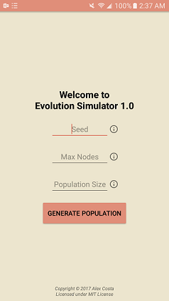
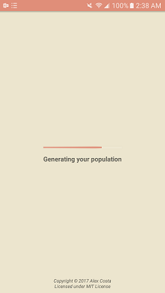

# Evolution Simulator
An evolution simulator based on the principles of natural selection. Built for Android OS.

## How it works
The simulator is based around these simple "creatures", which are shown below.

Each creature is composed of **muscles** and **nodes** which connect muscles together. Nodes are fairly simple objects and each node has a unique *friction*. This friction is the only differentiating factor between nodes. Muscles, however, are more complex, being governed by their *strength*, *contracted width*, *extended width*, *contracting time*, and *extending time*.

Each creature has a unique, static internal clock which decides when muscles are contracted and extended. All in all, these factors enable creatures to *move*, which is exactly what this evolution simulator measures as success. With each generation of creatures, the slowest are killed and fastest live to see another day and reproduce the next generation. It is survival of the fittest, and, in this way, natural selection guides the creatures through evolution until the creatures ultimately reach peak performance.

When you begin the simulator, you are asked for three things: a *seed*, *max node count*, and *population size*.

> Creatures are procedurally generated based of complete randomness (well, as random as a computer can possibly do) and randomness is generated from a unique seed. By supplying a specific seed, unique populations can be reconstructed to be tested again. 

> Max node count governs the maximum number of nodes creatures in your population can have (which then determines the range of possible muscles). The minimum node count is three, as a creature with less could never move. 

> Population size governs the size of the population that will be used throughout the simulation. The larger the population size, the greater the chance of positive mutations that increase performance of creatures, however, with too large of a population size performance may suffer. (Max node count is also capped at 13 nodes for performance sake).

Default max node count is 5 and default population size is 1000.

Creatures are partitioned into different species when they are generated based on their node count and muscle count, thus resulting in a heterogeneous population. With each generation, half of the population is killed based on performance and when the other half reproduces to return the population to a normal, there is a small chance of mutation for each node and muscle, changing the properties of each slightly. There is also a small chance of a creature losing or gaining nodes and muscles, though this is rare.

## Important

This project was inspired by Cary Huang and his Evolution Simulator which you can find at his youtube channel [Carykh](https://www.youtube.com/user/carykh). Though his source code has been released, this project was build without the help of his code. Functionally, however, it remains heavily inspired by his work. I urge you to check out his channel and his other great projects!

## Screenshots

This project is still in the middle of production, so UI might change substantially.

 
 
 

## Meta

